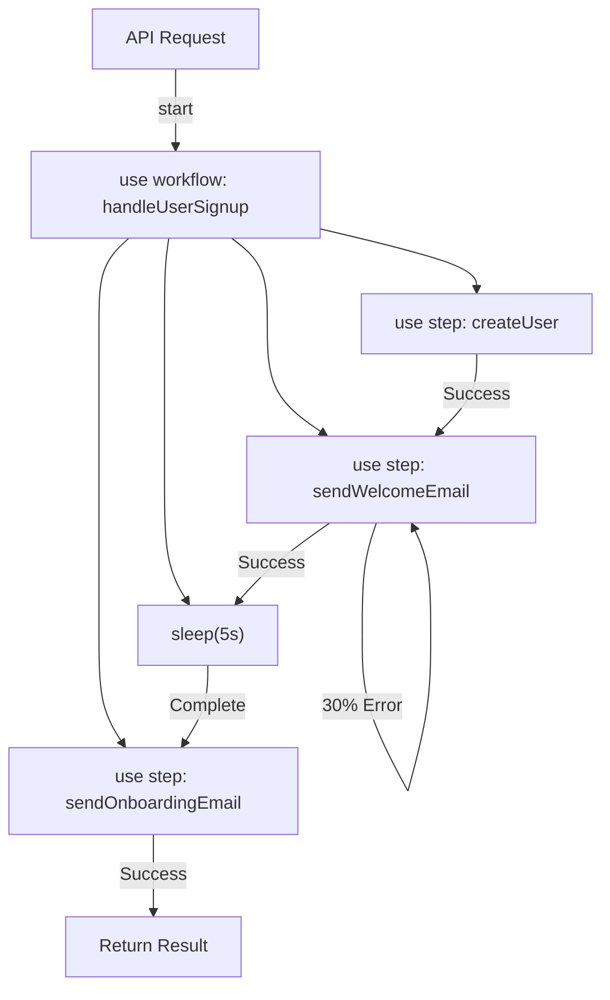

# 📖 Hono × Workflow DevKit プロジェクト作成ガイド

このドキュメントでは、Github MCPを使用してHono × Workflow DevKitのプロジェクトを作成する手順と、その背景にある設計判断を説明します。

## 🎯 目的

Vercel Workflow DevKitを使った**Durable Workflow（耐久ワークフロー）**のサンプルプロジェクトを、Github MCPを活用して自動的にセットアップする。

### なぜこのプロジェクトを作るのか？

- **Durable Execution**の実装パターンを学ぶ
- Honoを使った軽量API開発の基礎を理解する
- Github MCPによる自動化されたプロジェクトセットアップを体験する
- Next.jsなしでWorkflow DevKitを動かす方法を実証する

---

## 🛠️ 使用したツール

### 1. Github MCP（Model Context Protocol）

Claude経由でGithubを操作するためのツール。以下の機能を使用：

| ツール | 用途 | 使用箇所 |
|--------|------|----------|
| `github:create_repository` | リポジトリ新規作成 | プロジェクト初期化 |
| `github:create_or_update_file` | ファイル作成・更新 | 各設定ファイル追加 |

### 2. 技術スタック

| 技術 | バージョン | 役割 |
|------|-----------|------|
| **Hono** | ^4.6.14 | 軽量WebフレームワークAI（API実装） |
| **Nitro** | ^2.10.4 | ビルド・ランタイム管理 |
| **Workflow DevKit** | ^0.1.0 | Durable Workflow実装 |
| **TypeScript** | ^5.6.3 | 型安全な開発環境 |

---

## 📋 作成手順の全体像

### ステップ1: プロジェクト要件の確認

#### 必要な情報

```typescript
{
  repositoryName: "hono-workflow-app",      // リポジトリ名
  visibility: "public",                      // 公開設定
  description: "Hono × Workflow DevKit - Durable Workflow sample app",
  owner: "MAA39",                           // Githubアカウント名
  autoInit: true                            // README自動生成
}
```

**ポイント**: ユーザーから最低限の情報（リポジトリ名）だけを聞き、他は推奨設定を使用することで、スムーズにセットアップを開始。

---

### ステップ2: リポジトリ作成

```typescript
await github.create_repository({
  name: "hono-workflow-app",
  description: "Hono × Workflow DevKit - Durable Workflow sample app",
  private: false,
  autoInit: true
});
```

#### 作成結果

- リポジトリURL: `https://github.com/MAA39/hono-workflow-app`
- デフォルトブランチ: `main`
- 初期状態: README.md付き

---

### ステップ3: プロジェクト構造の設計

#### ディレクトリ構成

```
hono-workflow-app/
├── src/                    # アプリケーションコード
│   └── index.ts           # Hono APIサーバー
├── workflows/             # ワークフロー定義
│   └── user-signup.ts    # サンプルワークフロー
├── package.json          # 依存関係管理
├── tsconfig.json         # TypeScript設定
├── nitro.config.ts       # Nitro設定
├── .gitignore           # Git除外設定
└── README.md            # プロジェクトドキュメント
```

#### 設計の意図

| ディレクトリ/ファイル | 理由 |
|-------------------|------|
| `src/` | Honoのエントリーポイント。APIルートを定義 |
| `workflows/` | ワークフロー定義を分離。再利用性向上 |
| `nitro.config.ts` | Workflow DevKitの有効化に必須 |

---

## 📄 各ファイルの詳細解説

### 1. `package.json` - 依存関係定義

```json
{
  "name": "hono-workflow-app",
  "version": "0.1.0",
  "type": "module",
  "scripts": {
    "dev": "nitro dev",
    "build": "nitro build",
    "start": "node .output/server/index.mjs",
    "preview": "nitro preview"
  },
  "dependencies": {
    "hono": "^4.6.14",
    "nitro": "^2.10.4",
    "workflow": "^0.1.0"
  },
  "devDependencies": {
    "@types/node": "^22.9.1",
    "typescript": "^5.6.3"
  }
}
```

#### 重要な設定

| 設定 | 値 | 理由 |
|------|-----|------|
| `"type": "module"` | ESM | Workflow DevKitはESM専用 |
| `"dev": "nitro dev"` | Nitro開発サーバー | Honoの代わりにNitroで起動 |
| `workflow` | ^0.1.0 | Durable Execution機能を提供 |

**なぜNitroが必要なのか？**

Honoは軽量すぎて、ビルドシステムを持たない。Nitroを使うことで：
- `"use workflow"` / `"use step"` ディレクティブの処理
- ワークフローランタイムの統合
- デプロイ最適化

---

### 2. `tsconfig.json` - TypeScript設定

```json
{
  "compilerOptions": {
    "target": "ES2022",
    "module": "ESNext",
    "moduleResolution": "Bundler",
    "strict": true,
    "esModuleInterop": true,
    "skipLibCheck": true,
    "forceConsistentCasingInFileNames": true,
    "resolveJsonModule": true,
    "isolatedModules": true,
    "types": ["node"]
  },
  "include": ["src", "workflows"],
  "exclude": ["node_modules", ".output"]
}
```

#### 重要な設定

| 設定 | 理由 |
|------|------|
| `"module": "ESNext"` | ESMモジュールを使用 |
| `"moduleResolution": "Bundler"` | Nitroのバンドラーと互換性 |
| `"strict": true` | 型安全性を最大化 |
| `"include": ["src", "workflows"]` | ワークフローディレクトリも含める |

---

### 3. `nitro.config.ts` - Nitro設定

```typescript
import { defineNitroConfig } from "nitro/config";

export default defineNitroConfig({
  srcDir: "src",
  serverEntry: "index.ts",
  modules: ["workflow/nitro"],  // 👈 重要！
  experimental: {
    openAPI: true,
  },
});
```

#### 最重要設定

```typescript
modules: ["workflow/nitro"]
```

この1行が**Workflow DevKitを有効化**する。これにより：

1. `"use workflow"` ディレクティブが認識される
2. `"use step"` ディレクティブが認識される
3. `sleep()` 関数が完全非同期で動作する
4. ワークフローランタイムが統合される

**この設定がないと、ワークフローは全く動かない。**

---

### 4. `src/index.ts` - Hono APIサーバー

```typescript
import { Hono } from "hono";
import { start } from "workflow/api";
import { handleUserSignup } from "../workflows/user-signup.js";

const app = new Hono();

app.get("/", (c) => {
  return c.json({
    message: "Hono × Workflow DevKit API",
    endpoints: [
      "POST /api/signup - Start user signup workflow",
      "GET /health - Health check",
    ],
  });
});

app.post("/api/signup", async (c) => {
  try {
    const { email } = await c.req.json();
    
    if (!email) {
      return c.json({ error: "Email is required" }, 400);
    }
    
    // ワークフローを開始（バックグラウンドで実行される）
    await start(handleUserSignup, [email]);
    
    return c.json({
      message: "User signup workflow started",
      email,
    });
  } catch (error) {
    console.error("Error starting workflow:", error);
    return c.json({ error: "Failed to start workflow" }, 500);
  }
});

export default app;
```

#### 重要なポイント

| コード | 説明 |
|--------|------|
| `import { start } from "workflow/api"` | ワークフロー起動API |
| `await start(handleUserSignup, [email])` | ワークフローをバックグラウンドで開始 |
| `[email]` | ワークフロー関数への引数配列 |

**なぜ `await start()` なのか？**

- ワークフローは**即座にバックグラウンドで開始**される
- APIは待たずに即座にレスポンスを返す
- 長時間実行ジョブに最適

---

### 5. `workflows/user-signup.ts` - ワークフロー定義

```typescript
import { sleep, FatalError } from "workflow";

export async function handleUserSignup(email: string) {
  "use workflow";  // 👈 ワークフロー関数の宣言

  const user = await createUser(email);
  await sendWelcomeEmail(user);
  await sleep("5s");  // 👈 完全非同期Sleep
  await sendOnboardingEmail(user);

  return { userId: user.id, status: "onboarded" };
}

async function createUser(email: string) {
  "use step";  // 👈 ステップ関数の宣言
  
  console.log(`Creating user with email: ${email}`);
  return {
    id: crypto.randomUUID(),
    email,
  };
}

async function sendWelcomeEmail(user: { id: string; email: string }) {
  "use step";
  
  console.log(`Sending welcome email to user: ${user.id}`);
  
  // ランダムエラーで再試行をシミュレート
  if (Math.random() < 0.3) {
    throw new Error("Network error - will retry");
  }
  
  console.log(`✅ Welcome email sent to ${user.email}`);
}

async function sendOnboardingEmail(user: { id: string; email: string }) {
  "use step";
  
  // 不正なメールアドレスの場合は致命的エラー（再試行しない）
  if (!user.email.includes("@")) {
    throw new FatalError("Invalid email address");
  }
  
  console.log(`Sending onboarding email to user: ${user.id}`);
  console.log(`✅ Onboarding email sent to ${user.email}`);
}
```

#### ワークフローの設計パターン



#### ディレクティブの役割

| ディレクティブ | 効果 | 使用箇所 |
|--------------|------|----------|
| `"use workflow"` | 全体のオーケストレーション関数 | `handleUserSignup` |
| `"use step"` | 個別の処理単位（再試行可能） | 各ステップ関数 |
| `sleep("5s")` | 完全非同期待機（リソース消費なし） | ステップ間 |

#### エラーハンドリング戦略

```typescript
// 通常のError → 自動リトライ
throw new Error("Network error - will retry");

// FatalError → 即座に失敗（リトライしない）
throw new FatalError("Invalid email address");
```

---

### 6. `.gitignore` - Git除外設定

```gitignore
# Dependencies
node_modules/

# Build output
.output/
dist/

# Environment
.env
.env.local
.env.*.local

# Logs
logs/
*.log
npm-debug.log*

# OS
.DS_Store
Thumbs.db

# Editor
.vscode/
.idea/
*.swp
*.swo
*~

# Workflow data (ローカル開発用)
.workflow/
```

#### 重要な除外項目

| パターン | 理由 |
|----------|------|
| `.workflow/` | ワークフローの実行状態（ローカル開発用） |
| `.output/` | Nitroのビルド成果物 |
| `node_modules/` | 依存関係（必須） |

---

## 🔍 なぜこの構成にしたのか？

### 設計判断の理由

#### 1. HonoではなくNext.jsを使わない理由

| 比較項目 | Hono | Next.js |
|---------|------|---------|
| 初期化の速さ | ⚡ 即座 | 🐌 遅い |
| バンドルサイズ | 📦 小（~50KB） | 📦 大（数MB） |
| 学習曲線 | 📈 緩やか | 📉 急 |
| ランタイム対応 | ✅ Cloudflare/Bun/Deno | ❌ Node.jsのみ |
| 用途 | API/BFF特化 | フルスタック |

**結論**: API専用アプリならHonoが最適。

#### 2. Nitroをビルドツールとして採用した理由

| 理由 | 説明 |
|------|------|
| Workflow統合 | `workflow/nitro` モジュールが提供される |
| 軽量 | Next.jsより軽量だが、必要な機能は揃っている |
| マルチプラットフォーム | Vercel以外にも対応 |

#### 3. ワークフロー定義を分離した理由

```
src/          ← APIロジック（リクエスト/レスポンス）
workflows/    ← ビジネスロジック（非同期処理）
```

**メリット**:
- テストしやすい
- 再利用しやすい
- 責任分離が明確

---

## 🚀 実際の作成プロセス

### Github MCPでの実装手順

```typescript
// Step 1: リポジトリ作成
await github.create_repository({
  name: "hono-workflow-app",
  description: "Hono × Workflow DevKit - Durable Workflow sample app",
  private: false,
  autoInit: true
});

// Step 2: ファイルを順次作成
const files = [
  "package.json",
  "tsconfig.json", 
  "nitro.config.ts",
  ".gitignore",
  "README.md",
  "src/index.ts",
  "workflows/user-signup.ts"
];

for (const file of files) {
  await github.create_or_update_file({
    owner: "MAA39",
    repo: "hono-workflow-app",
    path: file,
    content: fileContents[file],
    message: `Add ${file}`,
    branch: "main"
  });
}
```

### なぜ一括プッシュではなく個別作成？

**理由**:
1. Github APIの制限でバッチ作成が失敗することがある
2. 各ファイルのコミット履歴が明確になる
3. エラーが起きても途中から再開できる

---

## 📊 作成されたファイルのサマリ

| ファイル | 行数 | 主な役割 |
|---------|------|---------|
| `package.json` | ~20 | 依存関係定義 |
| `tsconfig.json` | ~15 | TypeScript設定 |
| `nitro.config.ts` | ~10 | Workflow有効化 |
| `.gitignore` | ~30 | Git除外設定 |
| `README.md` | ~150 | プロジェクトドキュメント |
| `src/index.ts` | ~50 | Hono APIサーバー |
| `workflows/user-signup.ts` | ~70 | ワークフロー定義 |

**合計**: 約345行のコード（ドキュメント含む）

---

## ✅ セットアップ後の確認項目

### 1. ローカル環境での動作確認

```bash
# 依存関係インストール
npm install

# 開発サーバー起動
npm run dev

# 別ターミナルでテスト
curl -X POST http://localhost:3000/api/signup \
  -H "Content-Type: application/json" \
  -d '{"email":"test@example.com"}'
```

### 2. ワークフロー実行状況の確認

```bash
npx workflow inspect runs --web
```

### 期待される結果

1. ✅ サーバーが http://localhost:3000 で起動
2. ✅ APIが正常にレスポンスを返す
3. ✅ ワークフローがバックグラウンドで実行される
4. ✅ 各ステップのログが出力される
5. ✅ 5秒後にオンボーディングメールが送信される

---

## 🎯 学習ポイント

### このプロジェクトから学べること

1. **Github MCPの使い方**
   - リポジトリ作成の自動化
   - ファイル追加の自動化
   - CI/CD的なワークフロー

2. **Durable Workflowの実装**
   - `"use workflow"` / `"use step"` パターン
   - `sleep()` による非同期待機
   - エラーハンドリング戦略

3. **Honoの基礎**
   - 軽量APIサーバーの構築
   - TypeScriptでの型安全な実装
   - ミドルウェアなしのシンプル設計

4. **Nitroの活用**
   - ビルドツールとしての使い方
   - Workflow統合の仕組み

---

## 🔄 次のステップ

### プロジェクトの拡張アイデア

1. **データベース統合**
   ```typescript
   async function createUser(email: string) {
     "use step";
     return await db.users.create({ email });
   }
   ```

2. **実際のメール送信**
   ```typescript
   async function sendWelcomeEmail(user: User) {
     "use step";
     await sendgrid.send({
       to: user.email,
       template: "welcome"
     });
   }
   ```

3. **並列処理**
   ```typescript
   await Promise.all([
     sendWelcomeEmail(user),
     sendSlackNotification(user),
     updateAnalytics(user)
   ]);
   ```

4. **長期スケジュール**
   ```typescript
   await sleep("7d");  // 1週間後にリマインド
   await sendFollowUpEmail(user);
   ```

---

## 📚 参考リンク

- [Hono公式ドキュメント](https://hono.dev/)
- [Workflow DevKit公式ドキュメント](https://vercel.com/docs/workflow)
- [Nitroドキュメント](https://nitro.unjs.io/)
- [Github MCP仕様](https://modelcontextprotocol.io/)

---

## 🏁 まとめ

このドキュメントでは、Github MCPを使用してHono × Workflow DevKitプロジェクトを作成する完全な手順を解説しました。

### 重要なポイント

1. ✅ **Github MCPで自動化**できる範囲を理解する
2. ✅ **Nitroの設定**がWorkflow DevKitの肝
3. ✅ **ディレクティブ**（`"use workflow"` / `"use step"`）の役割
4. ✅ **エラーハンドリング**戦略の設計

このプロジェクトは、Durable Workflowの入門として最適なサンプルです。ぜひ拡張して、実際のプロダクトに活用してください！
